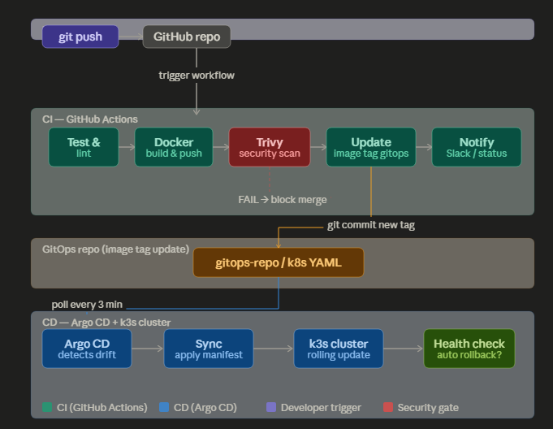

# Project Microservice Apps Dev Dashboard


Cara menjalankan dengan Docker Compose:
```bash
# Build semua image sekaligus
docker-compose build

# Jalankan semua service (detached/background)
docker-compose up -d

# Lihat log semua service
docker-compose logs -f

# Test endpoint
curl http://localhost:3000/dashboard

# Stop semua
docker-compose down
```

Recreated image dan Deploy container
```bash
docker-compose up --build -d

# Bangun ulang image (tanpa menggunakan cache untuk memastikan file index.js yang baru masuk)
docker-compose build --no-cache


```

Sebelum deploy ke kubernetes, push image ke Docker Hub dulu:
```bash
# Build & push weather-service
docker build -t mochabdulrouf/weather-service:v1 ./weather-service
docker push mochabdulrouf/weather-service:v1

# Build & push quote-service
docker build -t mochabdulrouf/quote-service:v1 ./quote-service
docker push mochabdulrouf/quote-service:v1

# Build & push api-gateway
docker build -t mochabdulrouf/api-gateway:v1 ./api-gateway
docker push mochabdulrouf/api-gateway:v1
```

1. Apply semua manifest sekaligus
```bash
kubectl apply -f k8s/
```

2. Pantau proses deployment
```bash
kubectl get pods -w
```
3. Pastikan semua Pod Running
```bash
kubectl get pods
# Output :
# NAME                              READY   STATUS    RESTARTS
# weather-service-xxx-xxx           1/1     Running   0
# quote-service-xxx-xxx             1/1     Running   0
# api-gateway-xxx-xxx               1/1     Running   0
```
4. Cek services
```bash
kubectl get svc
```

5. Test dari dalam cluster
```bash
kubectl run test-pod --image=curlimages/curl --rm -it --restart=Never -- \
  curl http://api-gateway:3000/dashboard
```

6. Test dari luar cluster (NodePort)
- Cari NodePort yang di-assign
```bash
kubectl get svc api-gateway
# Lalu akses: http://<IP-master-node>:<NodePort>/dashboard
```

7. Kalau pakai Ingress, tambahkan ke /etc/hosts:
```bash
echo "$(kubectl get node master-node -o jsonpath='{.status.addresses[0].address}') devdash.local" \
  | sudo tee -a /etc/hosts
curl http://devdash.local/dashboard
```
### Alur Deployment langsung
```bash
Developer
   │
   ├── git push
   │
   ▼
docker build & push (ke Docker Hub)
   │
   ▼
kubectl apply -f k8s/
   │
   ▼
K8s Scheduler → menempatkan Pod di node yang tepat
   │
   ├── master-node: api-gateway Pod
   └── node-1: weather-service Pod + quote-service Pod
```

# Pipeline ?

<b><center>Arsitektur</center>



🗂️ Struktur 2 Repository (GitOps Pattern)
Konsep utama GitOps: pisahkan kode aplikasi dan konfigurasi infrastruktur ke repository yang berbeda. Ini bukan preferensi — ini adalah keharusan agar Argo CD bisa bekerja dengan benar.
# Repo 1: source code aplikasi
```bash
microservice-dev-dash/                          ←  sudah punya ini
├── api-gateway/
├── weather-service/
├── quote-service/
└── .github/workflows/
    └── ci.yml                    ← GitHub Actions CI

# Repo 2: konfigurasi Kubernetes (GitOps repo)
microservice-gitops/                   ← buat repo baru ini di GitHub
├── apps/
│   ├── api-gateway/
│   │   └── deployment.yaml       ← image tag di sini yang diupdate CI
│   ├── weather-service/
│   │   └── deployment.yaml
│   └── quote-service/
│       └── deployment.yaml
├── argocd/
│   ├── app-api-gateway.yaml
│   ├── app-weather-service.yaml
│   ├── app-quote-service.yaml
│   └── appset-devdash.yaml      ← ApplicationSet (1 file untuk semua)
└── security/
    └── sealed-secrets/
```

⚙️ Step 1 — Install Argo CD di k3s
```bash
# Buat namespace khusus ArgoCD
kubectl create namespace argocd

# Install Argo CD (versi stable)
kubectl apply -n argocd \
  -f https://raw.githubusercontent.com/argoproj/argo-cd/stable/manifests/install.yaml

# Tunggu semua pod Running (~2-3 menit)
kubectl get pods -n argocd -w

# Expose UI Argo CD via NodePort (cocok untuk k3s lokal)
kubectl patch svc argocd-server -n argocd \
  -p '{"spec": {"type": "NodePort"}}'

# Ambil password admin awal (auto-generated)
kubectl -n argocd get secret argocd-initial-admin-secret \
  -o jsonpath="{.data.password}" | base64 -d && echo

# Login via CLI
argocd login <IP-master-node>:<NodePort> \
  --username admin \
  --password <password-di-atas> \
  --insecure

# Ganti password default segera!
argocd account update-password
```

🔄 Step 2 — GitHub Actions CI Pipeline
`.github/workflows/ci.yml` — ini adalah file terpenting. Satu push ke main, semua tahap jalan otomatis.
yamlname: CI Pipeline — DevDash

🔐 Step 3 — Security: Sealed Secrets untuk Credentials
Masalah umum: credential (API key, password DB) tidak boleh di-commit ke Git. Solusinya adalah Sealed Secrets — encrypt secrets sehingga aman disimpan di gitops repo.
# Install Sealed Secrets controller di k3s
```bash
kubectl apply -f https://github.com/bitnami-labs/sealed-secrets/releases/latest/download/controller.yaml
```

# Install kubeseal CLI tool
```bash
wget https://github.com/bitnami-labs/sealed-secrets/releases/latest/download/kubeseal-linux-amd64 \
  -O /usr/local/bin/kubeseal
chmod +x /usr/local/bin/kubeseal
```

```bash
# --- Cara pakai: ---

# 1. Buat Secret biasa dulu (jangan di-apply!)

kubectl create secret generic devdash-secrets \
  --from-literal=DB_PASSWORD="supersecret123" \
  --from-literal=SLACK_WEBHOOK="https://hooks.slack.com/xxx" \
  --dry-run=client -o yaml > /tmp/raw-secret.yaml


# 2. Encrypt jadi SealedSecret (ini yang di-commit ke git)

kubeseal --format=yaml < /tmp/raw-secret.yaml > security/sealed-secrets/devdash-sealed.yaml

# 3. File sealed bisa di-commit ke gitops repo dengan aman
git add security/sealed-secrets/devdash-sealed.yaml
git commit -m "security: add sealed secrets for devdash"

# 4. Apply ke cluster — controller decrypt otomatis
kubectl apply -f security/sealed-secrets/devdash-sealed.yaml

# security/sealed-secrets/devdash-sealed.yaml (contoh hasil encrypt):
yamlapiVersion: bitnami.com/v1alpha1
kind: SealedSecret
metadata:
  name: devdash-secrets
  namespace: default
spec:
  encryptedData:
    # Nilai ini sudah terenkripsi — aman di-commit ke Git
    DB_PASSWORD: AgBy8hCL8pGV...  # encrypted
    SLACK_WEBHOOK: AgCi9kDM...     # encrypted
  template:
    metadata:
      name: devdash-secrets
    type: Opaque
```

🚀 Step 4 — Argo CD Application Configuration
argocd/appset-devdash.yaml — satu file ini menggantikan 3 Application YAML terpisah menggunakan ApplicationSet:
yaml

```bash
# ApplicationSet: satu template, generate 3 Argo CD Application sekaligus
apiVersion: argoproj.io/v1alpha1
kind: ApplicationSet
metadata:
  name: devdash-services
  namespace: argocd
spec:
  # Generator: daftar semua service yang mau di-manage Argo CD
  generators:
  - list:
      elements:
      - service: api-gateway
        port: "3000"
        replicas: "2"
      - service: weather-service
        port: "3001"
        replicas: "2"
      - service: quote-service
        port: "3002"
        replicas: "2"

  # Template: blueprint untuk setiap Application
  template:
    metadata:
      name: '{{service}}'                   # nama Application di Argo CD UI
      namespace: argocd
      # Auto-delete Application jika dihapus dari list di atas
      finalizers:
      - resources-finalizer.argocd.argoproj.io

    spec:
      project: devdash                       # Project RBAC (buat di bawah)

      # Source: dari mana Argo CD ambil manifest
      source:
        repoURL: https://github.com/mochabdulrouf/devdash-gitops
        targetRevision: main                 # branch yang dipantau
        path: 'apps/{{service}}'            # folder per service

      # Destination: ke mana di-deploy
      destination:
        server: https://kubernetes.default.svc
        namespace: devdash                   # namespace khusus project

      # Sync policy: cara Argo CD men-sync
      syncPolicy:
        automated:
          prune: true        # hapus resource yang tidak ada di git
          selfHeal: true     # kembalikan resource yang diubah manual

        syncOptions:
        - CreateNamespace=true          # buat namespace jika belum ada
        - PrunePropagationPolicy=foreground

        # Retry jika sync gagal (jaringan putus, dll)
        retry:
          limit: 5
          backoff:
            duration: 5s
            factor: 2
            maxDuration: 3m

      # Health checks custom
      ignoreDifferences:
      - group: apps
        kind: Deployment
        jsonPointers:
        - /spec/replicas          # ignore jika HPA ubah replicas
```


🔒 Step 5 — Argo CD RBAC: Project & Role
argocd/project-devdash.yaml
```bash
# AppProject: batasi akses Argo CD ke scope yang sudah ditentukan
apiVersion: argoproj.io/v1alpha1
kind: AppProject
metadata:
  name: devdash
  namespace: argocd
spec:
  description: "DevDash microservices project"

  # Hanya boleh deploy dari repo ini
  sourceRepos:
  - https://github.com/mochabdulrouf/devdash-gitops

  # Hanya boleh deploy ke namespace ini di cluster ini
  destinations:
  - namespace: devdash
    server: https://kubernetes.default.svc

  # Resource yang boleh di-create/modify
  clusterResourceWhitelist:
  - group: ''
    kind: Namespace

  namespaceResourceWhitelist:
  - group: apps
    kind: Deployment
  - group: ''
    kind: Service
  - group: ''
    kind: ConfigMap
  - group: ''
    kind: Secret
  - group: networking.k8s.io
    kind: Ingress
  - group: autoscaling
    kind: HorizontalPodAutoscaler

  # Role: developer hanya bisa sync & view, tidak bisa delete
  roles:
  - name: developer
    description: "DevDash developer — sync only"
    policies:
    - p, proj:devdash:developer, applications, get,    devdash/*, allow
    - p, proj:devdash:developer, applications, sync,   devdash/*, allow
    - p, proj:devdash:developer, applications, create, devdash/*, deny
    - p, proj:devdash:developer, applications, delete, devdash/*, deny
    jwtTokens:
    - iat: 1704067200
```

📦 Step 6 — GitOps Repo: Deployment YAML per Service
apps/weather-service/deployment.yaml — ini yang diupdate oleh CI setiap push:
```bash
apiVersion: apps/v1
kind: Deployment
metadata:
  name: weather-service
  namespace: devdash
  annotations:
    # Metadata yang berguna untuk audit di Argo CD UI
    deployment.kubernetes.io/revision: "1"
spec:
  replicas: 2
  selector:
    matchLabels:
      app: weather-service
  template:
    metadata:
      labels:
        app: weather-service
        # Label versi untuk canary/blue-green nantinya
        version: v1
    spec:
      containers:
      - name: weather-service
        # ← Baris INI yang diupdate oleh GitHub Actions CI
        image: mochabdulrouf/weather-service:a1b2c3d  # SHA commit pendek
        ports:
        - containerPort: 3001
        envFrom:
        - secretRef:
            name: devdash-secrets       # dari Sealed Secrets
        resources:
          requests: { cpu: "100m", memory: "64Mi" }
          limits:   { cpu: "500m", memory: "256Mi" }
        livenessProbe:
          httpGet: { path: /health, port: 3001 }
          initialDelaySeconds: 10
          periodSeconds: 15
        readinessProbe:
          httpGet: { path: /health, port: 3001 }
          initialDelaySeconds: 5
          periodSeconds: 10
---
apiVersion: v1
kind: Service
metadata:
  name: weather-service
  namespace: devdash
spec:
  selector:
    app: weather-service
  ports:
  - port: 3001
    targetPort: 3001
  type: ClusterIP
---
# HPA — dari pelajaran troubleshooting sebelumnya!
apiVersion: autoscaling/v2
kind: HorizontalPodAutoscaler
metadata:
  name: weather-service-hpa
  namespace: devdash
spec:
  scaleTargetRef:
    apiVersion: apps/v1
    kind: Deployment
    name: weather-service
  minReplicas: 2
  maxReplicas: 10
  metrics:
  - type: Resource
    resource:
      name: cpu
      target:
        type: Utilization
        averageUtilization: 60
```

📊 Ringkasan Alur Lengkap End-to-End

```bash
1. Developer: git push ke devdash/main
        │
2. GitHub Actions CI:
   ├── npm audit (dependency scan)
   ├── docker build & push → mochabdulrouf/weather-service:a1b2c3d
   ├── trivy scan image → FAIL jika ada CVE HIGH/CRITICAL
   └── git commit ke devdash-gitops: image: ...weather-service:a1b2c3d
        │
3. Argo CD (polling setiap 3 menit):
   ├── deteksi perubahan di devdash-gitops
   ├── compare: git state vs cluster state (drift detection)
   ├── sync: kubectl apply apps/weather-service/deployment.yaml
   └── health check → rollback otomatis jika Pod gagal start
        │
4. k3s cluster:
   └── rolling update selesai tanpa downtime
```

- GitHub Secrets yang perlu ditambahkan di Settings → Secrets → Actions:
 
| Secret name | isinya |
| --- | --- |
| DOCKERHUB_TOKEN | Docker Hub access token (bukan password) |
| GITOPS_PAT | GitHub Personal Access Token dengan scope repo dan workflow |
| SLACK_WEBHOOK_URL | Webhook URL dari Slack App | 

Dengan setup ini, setiap git push ke main otomatis mengalir dari kode → image → security scan → deploy ke k3s tanpa perlu manual kubectl apply sama sekali. Argo CD juga akan mengembalikan (self-heal) jika ada yang iseng mengubah Pod secara manual langsung di cluster. Ini persis pola yang dipakai oleh Gojek, Tokopedia, dan perusahaan tech besar lainnya di production mereka.