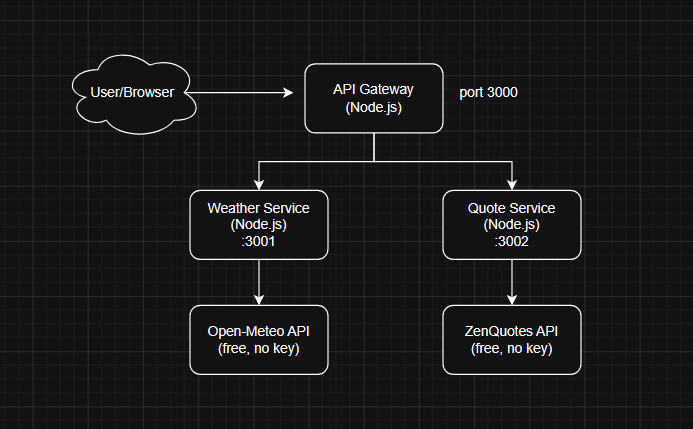

# Project Microservice Apps Dev Dashboard


Cara menjalankan dengan Docker Compose:
```bash
# Build semua image sekaligus
docker-compose build

# Jalankan semua service (detached/background)
docker-compose up -d

# Lihat log semua service
docker-compose logs -f

# Test endpoint
curl http://localhost:3000/dashboard

# Stop semua
docker-compose down
```

Sebelum deploy ke kubernetes, push image ke Docker Hub dulu:
```bash
# Build & push weather-service
docker build -t mochabdulrouf/weather-service:v1 ./weather-service
docker push mochabdulrouf/weather-service:v1

# Build & push quote-service
docker build -t mochabdulrouf/quote-service:v1 ./quote-service
docker push mochabdulrouf/quote-service:v1

# Build & push api-gateway
docker build -t mochabdulrouf/api-gateway:v1 ./api-gateway
docker push mochabdulrouf/api-gateway:v1
```

1. Apply semua manifest sekaligus
```bash
kubectl apply -f k8s/
```

2. Pantau proses deployment
```bash
kubectl get pods -w
```
3. Pastikan semua Pod Running
```bash
kubectl get pods
# Output :
# NAME                              READY   STATUS    RESTARTS
# weather-service-xxx-xxx           1/1     Running   0
# quote-service-xxx-xxx             1/1     Running   0
# api-gateway-xxx-xxx               1/1     Running   0
```
4. Cek services
```bash
kubectl get svc
```

5. Test dari dalam cluster
```bash
kubectl run test-pod --image=curlimages/curl --rm -it --restart=Never -- \
  curl http://api-gateway:3000/dashboard
```

6. Test dari luar cluster (NodePort)
- Cari NodePort yang di-assign
```bash
kubectl get svc api-gateway
# Lalu akses: http://<IP-master-node>:<NodePort>/dashboard
```

7. Kalau pakai Ingress, tambahkan ke /etc/hosts:
```bash
echo "$(kubectl get node master-node -o jsonpath='{.status.addresses[0].address}') devdash.local" \
  | sudo tee -a /etc/hosts
curl http://devdash.local/dashboard
```
### Alur Deployment langsung
Developer
   │
   ├── git push
   │
   ▼
docker build & push (ke Docker Hub)
   │
   ▼
kubectl apply -f k8s/
   │
   ▼
K8s Scheduler → menempatkan Pod di node yang tepat
   │
   ├── master-node: api-gateway Pod
   └── node-1: weather-service Pod + quote-service Pod


## Pipeline ?
